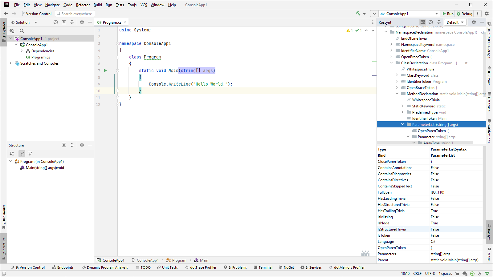
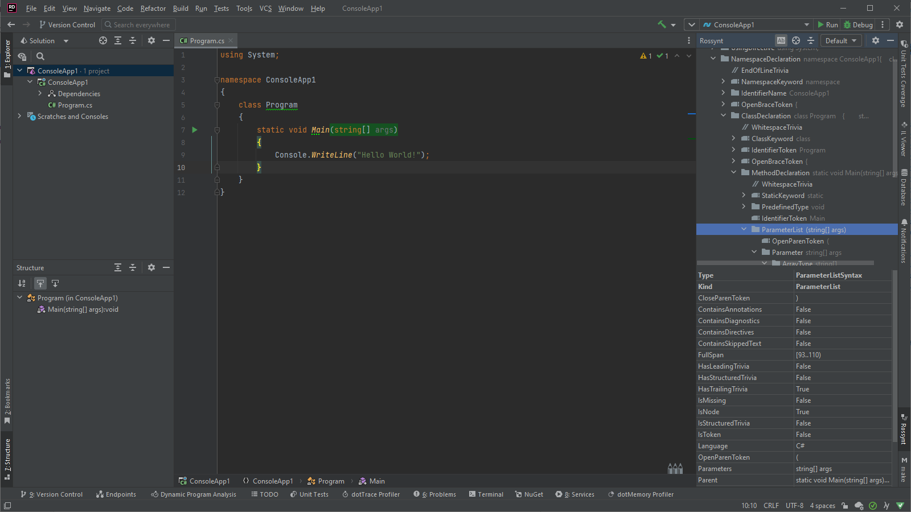

# Rossynt

[Changelog](CHANGELOG.md)
| [Architecture](docs/architecture.md)
| [Build](docs/build.md)

 

<!-- Plugin description -->
Rossynt - **Ros**lyn **syn**tax **t**ree viewer for C#. Works on JetBrains Rider and all other IntelliJ IDEA-based IDEs.

## System Requirements

* [ASP.NET Core Runtime](https://dotnet.microsoft.com/download/dotnet) (6.0, 7.0 or 8.0)
* [.NET CLI tool](https://docs.microsoft.com/en-us/dotnet/core/tools/)

These are all included if you have installed [.NET SDK](https://dotnet.microsoft.com/download/dotnet) or [Visual Studio](https://visualstudio.microsoft.com/downloads/).

## Features

* View syntax tree of C# files, including scratch files.
* View properties of each node.
* Highlight selected node in source code.
* Find corresponding node for selected text.
* Choose C# version for parsing source code.
* Support light theme and dark theme.

## Settings

* To configure the plugin, go to
    * `Settings | Tools | Rossynt` for Windows and Linux
    * `Preferences | Tools | Rossynt` for macOS

<!-- Plugin description end -->

## Installation

- Using IDE built-in plugin system:

  <kbd>Settings/Preferences</kbd> > <kbd>Plugins</kbd> > <kbd>Marketplace</kbd> > <kbd>Search for "Rossynt"</kbd> >
  <kbd>Install Plugin</kbd>

- Manually:

  Download the [latest release](https://github.com/GitHubPang/Rossynt/releases/latest) and install it manually using
  <kbd>Settings/Preferences</kbd> > <kbd>Plugins</kbd> > <kbd>⚙️</kbd> > <kbd>Install plugin from disk...</kbd>

---
Plugin based on the [IntelliJ Platform Plugin Template][template]. Commits are cherry-picked from that repository from time to time, which explains why GitHub shows some authors as contributors even though they don't commit to this repository directly.

[template]: https://github.com/JetBrains/intellij-platform-plugin-template
